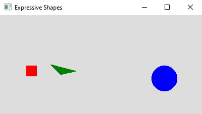

# Expressive Shapes

A simple template app for the Expressive Shapes project built in Python using pyqt5.

To get started:

- Download this repo via git (or by downloading the project .zip)
> git clone [repo]
- Install pyqt5 (this can take a few minutes)
> pip install pyqt5
- Replace the template code in *https://github.com/ethanrwilson1998/expressive-shapes/shapes.py*		

		def move(self, shapes):  
			# your movement code here, replace this sample code:  
			if self.x < 0:  
				self.direction = 1  
			if self.x + self.w >= canvas_width:  
				self.direction = -1  

			self.x += self.speed * self.direction  
			##########

- The template code moves rectangles horizontally and circles vertically, changing direction when they reach the edge of the canvas.  Triangles toggle directions to move in a square.
- When the move function is called, the list of all shapes in the scene is returned.  By using the information in this list, you will be able to plan a shape's movement based on the positions/colors/sizes of other shapes.

# Homework Statement:

Tell a story using three distinct shapes: rectangles, ellipses, and triangles.  
Using the characteristics (size, color, shape) and actions of the objects, convey a
story.  For example, large circles could be programmed to chase after smaller squares, 
conveying that the squares are afraid and running away.

Submissions will be graded on three criteria:

- Does the code run as intended?  
    - All three base shape classes (rectangle, ellipse, triangles) must be incorporated.
    - There must be significant change from the provided template.
    
- Written description of intent.  A short description (no more than 300 words) that describes 
the shapes' intent towards each other and the implementation you took to achieve it.

- Code alignment with the description.  Artistic expression is arbitrary, but there must be an
obvious link between the written description and what is actually seen when running the codebase.

What to submit:

- Your updated shapes.py file.  All work should be done in shapes.py.

- Written description of intent

- Oral/Visual presentations will be done in class, giving the opportunity for discussion.
